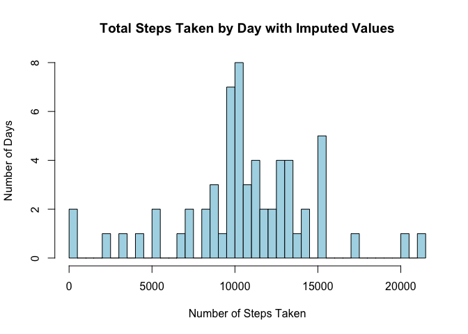

# Reproducible Research: Peer Assessment 1
Christopher Castle  
## Loading and preprocessing the data
___

To begin we'll read our data set into R and process the date variable.

```r
# open the compressed file and read into r 
act <- read.csv(unz("activity.zip", "activity.csv"))

act$date <- as.Date(act$date) # convert date variable to Date object
```
## What is mean total number of steps taken per day?
___
Next we'll sum the total number of steps taken per day and produce a histogram.  

```r
# sum steps taken per day
total_day <- tapply(act$steps, act$date, sum)
# histogram of total steps/day
hist(total_day, xlab="Number of Steps Taken", ylab='Number of Days', 
     main="Total Steps Taken by Day", breaks=61, col='lightblue')
```

 

```r
# store mean and median values to be used in text
og_mean <- format(mean(total_day, na.rm=TRUE ), big.mark = ",")
og_med <- format(median(total_day, na.rm=TRUE), big.mark = ",")
```
The mean total steps taken per day are 10,766.19 and the median total steps per day are 10,765.   

## What is the average daily activity pattern?
___
Let's look at a time series of the data with the time of day (in the format HHMM) along the x-axis and the average number of steps taken in that interval on the y-axis.

```r
# mean for steps at each interval, averaged across days
avg_by_interval <- tapply(act$steps, act$interval, mean, na.rm=TRUE)
plot(x= unique(act$interval), y=avg_by_interval, type='l', ylab="Number of Steps",
     xlab="Interval", col='lightblue', lwd=2.5, main="Number of Steps Taken by Interval")
```

 

```r
# find the interval with the most steps taken on average
most_steps <- max(avg_by_interval)
most_steps <- round(most_steps)
# time of max average steps
ms_time <- names(avg_by_interval[avg_by_interval == max(avg_by_interval)])
```

There is clearly a spike on the graph in the morning when approximately 206 steps are taken on average at 835am.

## Imputing missing values
___

```r
# total missing values in data frame
sum_na <- sum(is.na(act))
```
This data set has a significant amount of missing values. The total number of rows with NA values are 2304 or 13% of all rows. Some days are entirely devoid of step data.

We can use a regression tree from the rpart package to impute missing values based on our date and interval variables.


```r
library(rpart)
# create a new copy of our data frame
new_act <- act
# fit an rpart model
fit <- rpart(steps ~ date + interval, data=new_act)
# predict missing values using the rpart model
pred <- predict(fit, new_act[is.na(new_act$steps),])
# replace missing values with predictions
new_act$steps[is.na(new_act$steps)] <- pred
# verify there aren't any missing values
new_sum_na <- sum(is.na(new_act))
```
We now have a complete data frame with 0 missing values.

Let's make a histogram and find the mean and median of the data as we did at the beginning of this report, but this time we'll use our new data.


```r
# new mean steps taken per day
new_total_day <- tapply(new_act$steps, new_act$date, sum, na.rm=TRUE)
hist(new_total_day, xlab="Number of Steps Taken", ylab='Number of Days', 
     main="Total Steps Taken by Day with Imputed Values", breaks=61, col='lightblue')
```

 

```r
# store formatted median and mean values for use in text
imp_mean <- format(mean(new_total_day, na.rm=TRUE ), big.mark = ",")
imp_med <- format(median(new_total_day, na.rm=TRUE), big.mark= ",")
# difference in all total steps between new and original data
step_diff <- format(sum(new_total_day) - sum(total_day, na.rm=TRUE), big.mark=",")
```
The *new* mean total steps taken per day are 10,689.38 while the median total steps taken per day are 10,439.

Comparing these to our earlier values we can see that they're slightly more varied. The original values were nearly identical. 

The new values are also lower than the originals, which is counterintuitive. We've just added 81,444.3 new step values so it would be reasonable to assume the mean and median would increase. Looking into our code from earlier we can see that the mean/median have decreased because we haven't told the sum function to remove NA's. The knock-off effect of this is that the number of days we're dividing by when we calculate mean/median is smaller with the original vector.


```r
og_den <- sum(!is.na(total_day))
new_den <- sum(!is.na(new_total_day))
```
The denominator for calculating the mean by day of the original data is 53 while the denominator for the mean of the new data is 61. The new data set has 81,444.3 more steps than the original but the denominator is larger so the median and mean steps per day are lower.

```r
og_sd <- round(sd(total_day, na.rm=TRUE))
new_sd <- round(sd(new_total_day, na.rm=TRUE))
```
The standard deviation has also decreased by a few hundred steps from 4269 steps in the original data to 4001 steps in the new data. The distribution has bunched up a little more around the mean and gotten "skinnier." 


## Are there differences in activity patterns between weekdays and weekends?
___
Next we'll use the weekdays() function in R to analyse the difference between weekend and weekday steps. 

```r
# convert the date var into a day of the week and store it in a new column
new_act$day <- weekdays(new_act$date)
# convert Sat and Sun to weekend and everything else to weekdays
new_act$day <- ifelse(new_act$day == "Saturday" | new_act$day == "Sunday",'weekend','weekday')
new_act$day <- as.factor(new_act$day)
# split the data into weekend and weekday data frames
s <- split(new_act, new_act$day)
weekend <- s[[2]]
weekday <- s[[1]]
# create vectors of average steps by interval for weekend and weekday
end_avg_interval <- tapply(weekend$steps, weekend$interval, mean)
day_avg_interval <- tapply(weekday$steps, weekday$interval, mean)
par(mfrow=c(2,1))
plot(x=unique(weekend$interval), y=end_avg_interval, type='l', col='salmon', lwd=2.5,
     main = "Weekend", ylab="Number of Steps", xlab="Interval")
plot(x=unique(weekday$interval), y=day_avg_interval, type='l', col='salmon', lwd=2.5,
     main = "Weekday", ylab="Number of Steps", xlab="Interval")
```

 

The average number of steps on weekdays still has the largest spike in the morning. The weekend data has a peak in steps before 10am as well but there are many smaller spikes throughout the rest of the day. In general, the weekend data appears much more uniform than the weekday data. 
